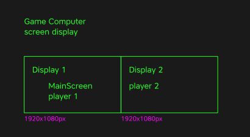

# DTCC_expo

# 1. Introduction

List of computers used in exhibition :


# 2. Easy installation with linux iso images : 
## Router configuration [!] :

1. Set the router in router mode.
2. Set the ssid and password of the Wi-fi network.
```
ssid = ddtc
password = random2568
```

---

## For each player :
You can download the ISO image at this address:

### Link of ENGLISH version :
[https://system.freeboxos.fr:81/share/6N-wyZYg5k9gKt06/mireos-V11_eng.iso](https://system.freeboxos.fr:81/share/6N-wyZYg5k9gKt06/mireos-V11_eng.iso)

### Link of FRENCH version :
[https://system.freeboxos.fr:81/share/yLmuux99JEPK7C92/mireos-V11_fr.iso](https://system.freeboxos.fr:81/share/yLmuux99JEPK7C92/mireos-V11_fr.iso)

How to install the ISO image on a USB key:

1. Download the iso image
2. Download the software [balenaEtcher](https://www.balena.io/etcher/)
3. Open balenaEtcher and select the iso image
4. Select the USB key
5. Click on "Flash" and wait for the end of the installation
  
  
### Time to boot tiny computer on usb flash drive:  
How to boot on the USB key :

1. Plug the USB key on the computer
2. Turn on the computer
3. Press the key to enter the boot menu (F12 or del for most computers)
4. Select the USB key in the boot menu
5. Save and exit
6. At this point, the computer should boot on the USB key, it take 5 minutes to begin to view image on the screen

You can also turn on the "always power on" option in the BIOS to avoid the computer turning off when there is a power cut.

/!\ Repeat this operation for the 5 other player's computers.

---

You can test if each computer is connected to the software Angry IP Scanner. You can download it at this address:
[https://angryip.org/download/](https://angryip.org/download/)
  

Exemple of the result of the scan :


---

## For the game computer :

- Boot your computer with your favorite system (Window or Linux)
- Connect the computer to the ddtc WIFI network (ssid : ddtc / pass : random2568)
- The two screens of the computer must be connected to the graphics card and displayed in landscape mode.

- Connect the 2 gamepads to the computer.
- Connect the computer to the ddtc WIFI network.

Hide the bar menu in UBUNTU :
[https://www.maketecheasier.com/hide-top-bar-ubuntu/](https://www.maketecheasier.com/hide-top-bar-ubuntu/)

Download the game : 

Linux version :  
[https://system.freeboxos.fr:81/share/TrqkPLZGgUScgbTD/linux.zip](https://system.freeboxos.fr:81/share/TrqkPLZGgUScgbTD/linux.zip)

Windows version :  
[https://system.freeboxos.fr:81/share/RBT0y9DOTfa4e04x/windows.zip](https://system.freeboxos.fr:81/share/RBT0y9DOTfa4e04x/windows.zip)

Just launch the game and enjoy !


---


https://user-images.githubusercontent.com/10529582/234791595-98aa489d-e18d-422a-af80-0de9a6f10761.mp4

---

## FRENCH VERSION :

# Digital Tools for Creative Collaboration 
Un événement dans le cadre du projet  

À la suite des confinements dus au Covid-19, la collaboration à distance est devenue la nouvelle norme, dans de nombreux lieux  de travail, d’enseignement et d’apprentissage. 
Les outils numériques permettant de communiquer ou  d’effectuer des tâches partagées, bien que connus et utilisés  avant cette crise, ont depuis pris une ampleur nouvelle et adopté des formats multiples.  
Néanmoins, peu d’entre eux semblent correspondre aux besoins du secteur créatif. 
Dans l’enseignement supérieur, en art et design en particulier, le recours à des outils généralement issus de la « Silicon Valley »  interrogent également sur les logiques d’usage qui sous tendent ces logiciels. 
C’est à cette thématique que le projet Digital Tools for Creative Collaboration (Outils numériques pour la collaboration créative)  s’intéresse depuis mai 2021, via une collaboration entre trois établissements : l’École supérieure d’art et design de Saint Étienne (Esadse), Eesti Kunstiakadeemia (EKA) à Tallinn  (Estonie) et la Hochschule für Gestaltung (HfG) de Schwäbisch Gmünd (Allemagne) ainsi que le Bureau Européen des  Associations de Design (Beda) en tant que partenaire associé. Digital Tools for Creative CollaborationQuels outils numériques  pour enseigner l’art et le design en temps post-covid ? 
Par des workshops internationaux, des réunions et discussions collectives et des créations en commun, Digital Tools for  Creative Collaboration a initié divers projets inter-écoles. 
Parmi ceux produits par l’Esadse, figure la création d’un  catalogue « ressource » et critique d’outils collaboratifs en ligne,  l’organisation de rencontres professionnelles entre écoles d’art & design (openschool.art), ainsi que plusieurs publications et  expérimentations. 
Dans la continuité, chaque école partenaire a pris en charge un moment de partage public du projet selon différentes modalités  (présentations de projets issus des cours et des workshops, conférences, etc.). L’exposition proposée par le Random(lab) de  l’Esadse au Magasin est l’une de ces cristallisations sous la forme de paroles d’étudiants internationaux mises en lien avec  un jeu vidéo collaboratif développé spécialement pour l’occasion. 

Du 24.04 au 28.04.2023 
13h-19h 

- L’exposition se compose d’entretiens vidéo d’étudiants des trois écoles  partenaires qui opèrent un recul critique sur le projet  ainsi que sur cette expérience de collaboration durant laquelle différentes méthodologies de travail et approches du design se sont croisées ;
- de « bugs » programmés par les étudiantes de  l’Esadse qui viennent perturber ces vidéos ; 
- d’un jeu vidéo 3D collaboratif développé à l’aide de logiciels libres (logiciel 3D Blender et moteur de jeu  Godot). Ce jeu vidéo proche d’un « simulateur de balades » (walking simulator) invite deux joueurs  à se retrouver sur une carte.  
Pour parvenir à cela, elles/ils doivent impérativement se parler de vive voix afin de partager des indices sur l’endroit où elles/ils se trouvent. 

## Étudiant.e.s participant.e.s 
Maëlys Bard, Max Becht, Sarah Boutière, Paulina Juárez Badillo Chávez, Sigmund Abou  Chrouch, Artemiy Guslistov, Hugo Guyomard, Ludovic Hohl, Mathias Hû, Kristi Laanemäe, Tara Monheim, Alféa Morelli, Daisy Muntean, Natsumi Nonaka, Alina Remlinger, Marius Schairer, Viki Schmidt, Kaisa Uik, Yareny Duriez Urías, Mark Uustalu. 

## Programmation des « Bugs » 
Sarah Boutière, Eloïse Debrand, Benoît Fage,  Max Flachaire, Ludovic Hohl, Maxence Mardargent. 

## Développement du jeu vidéo 
Damien Baïs (prof. Esadse) et David-Olivier Lartigaud (prof. Esadse/École nationale supérieure des beaux arts de Lyon). 

## Montage vidéo
Marc Guntow (prof. HfG Schwäbisch-Gmünd).

## Encadrant.e.s du projet Digital Tools for Creative Collaboration 
Cléa Di Fabio (Esadse) et Jérémie Nuel (prof. Esadse) avec Damien Baïs (prof. Esadse), François Brument (prof. Esadse), David-Olivier Lartigaud (prof. Esadse), Lucile Schrenzel (prof. Esadse), Marc Guntow (prof. HfG Schwäbisch-Gmünd), Ludwig Kannicht (prof.  HfG Schwäbisch-Gmünd), Tanel Kärp (prof. EKA Tallinn), Jekaterina Suharenko (prof. EKA Tallinn), ainsi que Inge Eller (relations internationales Cité du design/Esadse) et Maria Moreira (relations internationales Cité du design/Esadse). 
Avec l'aide de Jacques-Daniel Pillon (ens. Esadse). 

L’exposition C'est toi et moi, de base est organisée par le Random(lab) de l’Esadse avec les étudiants de  3e année et la mention Création Numérique de l’option Design. 
Ce projet est soutenu par le programme européen Erasmus +

# ENGLISH VERSION :

# Digital Tools for Creative Collaboration
An event within the project

Following the Covid-19 lockdowns, remote collaboration has become the new norm in many workplaces, educational institutions, and learning environments. Although digital tools for communication and shared tasks were known and used before this crisis, they have since taken on new importance and adopted multiple formats. However, few of them seem to meet the needs of the creative sector. In higher education, particularly in art and design, the use of tools typically derived from the "Silicon Valley" also raises questions about the usage logic underlying these software programs.
The Digital Tools for Creative Collaboration project has been exploring this theme since May 2021, through a collaboration between three institutions: the École Supérieure d'Art et Design de Saint Étienne (Esadse), the Eesti Kunstiakadeemia (EKA) in Tallinn (Estonia), and the Hochschule für Gestaltung (HfG) in Schwäbisch Gmünd (Germany), as well as the Bureau Européen des Associations de Design (Beda) as an associated partner.
Through international workshops, collective meetings and discussions, and collaborative creations, Digital Tools for Creative Collaboration has initiated various inter-school projects. Among those produced by the Esadse is the creation of a "resource" and critical catalog of online collaborative tools, the organization of professional meetings between art and design schools (openschool.art), as well as several publications and experiments. In continuation, each partner school has taken charge of a public sharing moment of the project according to different modalities (presentations of projects from courses and workshops, conferences, etc.). The exhibition proposed by the Random(lab) of the Esadse at the Magasin is one of these crystallizations in the form of international student testimonies linked to a collaborative video game developed specifically for the occasion.

From April 24th to 28th, 2023, from 1pm to 7pm :
- The exhibition consists of video interviews with students from the three partner schools who critically reflect on the project and on their collaboration experience, during which different working methodologies and design approaches intersected;
- "Bugs" programmed by Esadse students that disrupt these videos;
- A collaborative 3D video game developed using free software (Blender 3D software and Godot game engine). This video game, similar to a "walking simulator," invites two players to meet on a map. In order to do so, they must talk to each other in person to share clues about where they are.

## Participating students
Maëlys Bard, Max Becht, Sarah Boutière, Paulina Juárez Badillo Chávez, Sigmund Abou Chrouch, Artemiy Guslistov, Hugo Guyomard, Ludovic Hohl, Mathias Hû, Kristi Laanemäe, Tara Monheim, Alféa Morelli, Daisy Muntean, Natsumi Nonaka, Alina Remlinger, Marius Schairer, Viki Schmidt, Kaisa Uik, Yareny Duriez Urías, Mark Uustalu.

## "Bugs" programming
Sarah Boutière, Eloïse Debrand, Benoît Fage, Max Flachaire, Ludovic Hohl, Maxence Mardargent.

## Video game development
Damien Baïs (prof. Esadse) and David-Olivier Lartigaud (prof. Esadse/École nationale supérieure des beaux arts de Lyon).

## Video editing
Marc Guntow (prof. HfG Schwäbisch-Gmünd).

## Project supervisors for Digital Tools for Creative Collaboration
Cléa Di Fabio (Esadse) and Jérémie Nuel (prof. Esadse) with Damien Baïs (prof. Esadse), François Brument (prof. Esadse), David-Olivier Lartigaud (prof. Esadse), Lucile Schrenzel (prof. Esadse), Marc Guntow (prof. HfG Schwäbisch-Gmünd), Ludwig Kannicht (prof. HfG Schwäbisch-Gmünd), Tanel Kärp (prof. EKA Tallinn), Jekaterina Suharenko (prof. EKA Tallinn), as well as Inge Eller (international relations Cité du design/Esadse) and Maria Moreira (international relations Cité du design/Esadse).
With the help of Jacques-Daniel Pillon (ens. Esadse).

The exhibition "C'est toi et moi, de base" is organized by the Random(lab) of the Esadse with the participation of 3rd-year students and the Digital Creation program of the Design option.
This project is supported by the European Erasmus + program

---

# Raw material for communication

Images, svg, pdf...

[Raw material in this folder (Click me)](./posters)


---

# Open source Random(lab)

The game and player is open source and you can find the source code on this adress :

The players :  
[https://github.com/RandomLab/DDTC_player](https://github.com/RandomLab/DDTC_player)

The Game :  
[https://github.com/RandomLab/DTCC_game](https://github.com/RandomLab/DTCC_game)
